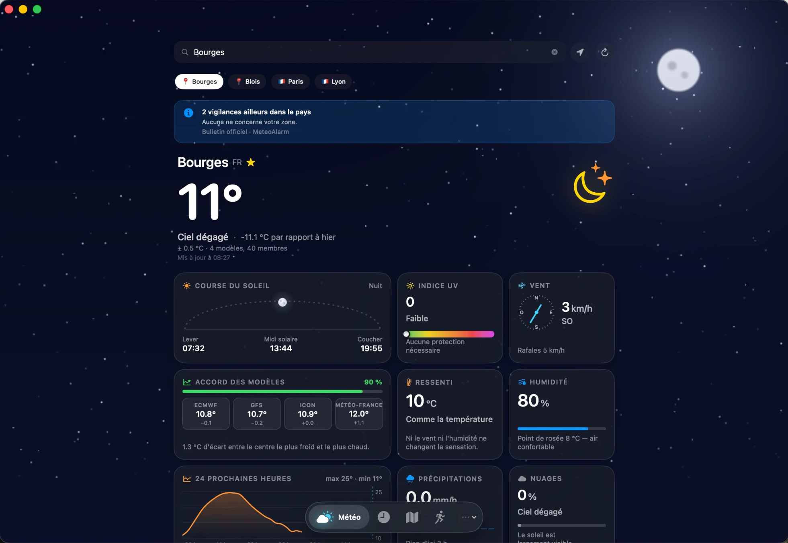

# WeatherHub

**A native macOS weather app whose sky is drawn by the GPU.**
Swift · SwiftUI · Metal · MapKit — by [Mathis Soupizon](https://patapain18.github.io/#weatherhub)



WeatherHub shows the weather the way a window would: behind every screen, the
sky is rendered live in a Metal shader — nineteen conditions, ten of them
extreme (tornado, cyclone, hail, blizzard, freezing rain, heatwave, dust…),
following the real time of day, sunrise and sunset.

On top of it:

- **Forecasts** from several models (Open-Meteo, OpenWeather), with a
  reliability gauge that shows how much the models agree
- **Tiles** in the style of Apple Weather — sun arc, UV, wind, air quality,
  pressure, dew point, 24-hour trend, rain over the next three hours
- **Favourite cities** in a sidebar, current location via Core Location
- **Alerts** (MeteoAlarm in Europe, weather.gov in the US), **radar**
  (RainViewer) and a **satellite** layer (Meteosat, EUMETSAT)
- **A sports profile**: eight sports, each scored 0–100 against your own
  thresholds (wind, gusts, rain, UV, heat, cold), with the best time slot
  of the day — and a map of nearby sports facilities
- **A demo mode** to see every sky without waiting for the weather

## Build and run

Requirements: macOS 14 or later, Xcode 15 or later.

1. Open `WeatherHub.xcodeproj`.
2. The OpenWeather key is **not** in the repository. In `WeatherHub/`, copy
   `Cles.exemple.swift` to `Cles.swift` and paste a free key from
   https://openweathermap.org/api (Xcode already references the file).
3. Choose **My Mac** and press **⌘R**.

`Cles.swift` is in `.gitignore`: it never ends up in a commit.

The interface is in French. To see the skies: menu **⋯ → Mode démo**, or
from the command line:

```
WeatherHub.app/Contents/MacOS/WeatherHub --simuler=tornado,nuit,alerte
```

The app is not signed with an Apple Developer ID, so it is not distributed
as a download: macOS would refuse to open it. Build it from source instead.

## Where to look

| File | What it does |
|---|---|
| `Ciel.metal`, `CielMetal.swift` | The sky: 19 conditions computed pixel by pixel, in an `MTKView` under the content |
| `Effets.metal` | Heat haze that bends the header during a heatwave |
| `WeatherService.swift` | Every network call (Open-Meteo, OpenWeather, Sensor.Community, MeteoAlarm…) |
| `WeatherViewModel.swift` | Merging the sources, the reliability index, async/await |
| `SportProfile.swift` | Sports scoring: continuous penalties, per-sport weights, thunderstorm veto |
| `WeatherTabView.swift`, `TuileMeteo.swift` | The tile grid |

---

## En français

**Une appli météo macOS native dont le ciel est dessiné par le GPU.** Le ciel
de chaque écran est un shader Metal : dix-neuf conditions, dont dix régimes
extrêmes, qui suivent l'heure réelle, le lever et le coucher du soleil.
Autour : prévisions multi-modèles avec un indice de fiabilité, tuiles façon
Apple Météo, villes favorites, alertes, radar, satellite, et un profil
sportif qui note huit sports de 0 à 100 selon tes propres seuils.

### Compiler

- macOS 14 ou supérieur, Xcode 15 ou supérieur (gratuit sur l'App Store).
- Ouvrir `WeatherHub.xcodeproj`, cible **My Mac**, puis **⌘R**.
- **La clé API** : dans `WeatherHub/`, copier `Cles.exemple.swift` sous le nom
  `Cles.swift` et y coller une clé OpenWeather gratuite
  (https://openweathermap.org/api — 1 000 appels/jour).

Pour fabriquer un `.app` : **Product → Archive**, puis dans l'Organizer
**Distribute App → Copy App**.

### Problèmes fréquents

- *« Signing requires a development team »* → cible WeatherHub → Signing &
  Capabilities → cocher *Automatically manage signing* et choisir son Apple ID
  (un compte gratuit suffit).
- *« Cannot find module 'SwiftUI' »* → vérifier que la cible est bien **macOS**,
  pas un simulateur iOS.
- *Données météo vides* → vérifier que `Cles.swift` existe et contient une
  clé valide.

### Mode démo

Menu **⋯ → Mode démo** : une condition (ordinaire ou extrême), un moment de la
journée, une alerte fictive. Conditions : clear, clouds, rain, shower, drizzle,
thunder, snow, fog, tornado, cyclone, storm, hail, blizzard, freezing, deluge,
heat, cold, dust · moments : jour, lever, coucher, nuit.
